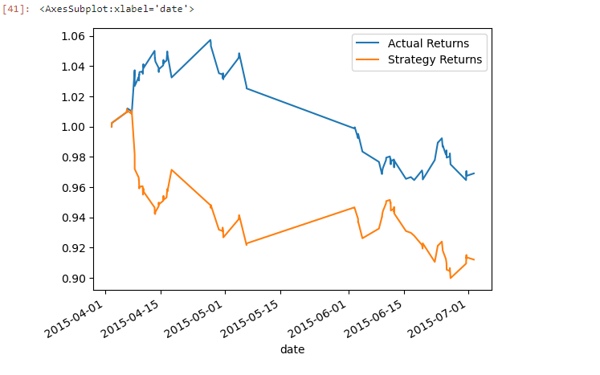

# Machine Learning Trading Bot


-----------
# Overview

This repo contains implementation of algorithmic strategy that uses machine learning to automate the trade decisions. Input paramters were adjusted to autopmate the trade decisions and dataset trained on a new machine learning model to compare it's performance to that of the baseline model.  


# Technologies

Python is the primary language used to code this application through juyper lab. Pandas and numpy libraries utilized to maniupuate the dataset using dataframes. Pathlib to import the data csv file. For plotting the chart hvplot and pyplot librari is utilized. Finally, scikit-learn library is utilized to laverage machine learning models for predictions. 

This project leverages python 3.7 with the following packages:

* [CSV](https://docs.python.org/3/library/csv.html) - CSV library is utlized to read and store the data.
* [Pandas](https://github.com/pandas-dev/pandas) - Pandas library is utlized to prepare and analyze the data
* [Numpy](https://numpy.org/doc/stable/user/whatisnumpy.html) - Numpy library used for math calculations
* [Matplotlib](https://matplotlib.org/stable/index.html) -  Matplot library used for graph plotting
* [Pathlib](https://docs.python.org/3/library/pathlib.html) - Path library to provide local file path
* [hvplot](https://hvplot.holoviz.org/) - High-level API for data exploration and visualization 
* [Scikit](https://scikit-learn.org/stable/install.html) - Scikit-learn is an open source machine learning library that supports supervised and unsupervised learning.


## Installation Guide


Before running the application first install the following dependencies.

```python
  pip install csv
  pip install pandas
  pip install matplotlib
  pip install pathlib
  pip install Numpy
  pip install -U scikit-learn
  pip install hvplot
  
```


## Usage

Use the following command to run the app

```git to the directory and type
 jupyter lab
```

## Baseline chart on investement returns through Stretgic investment





